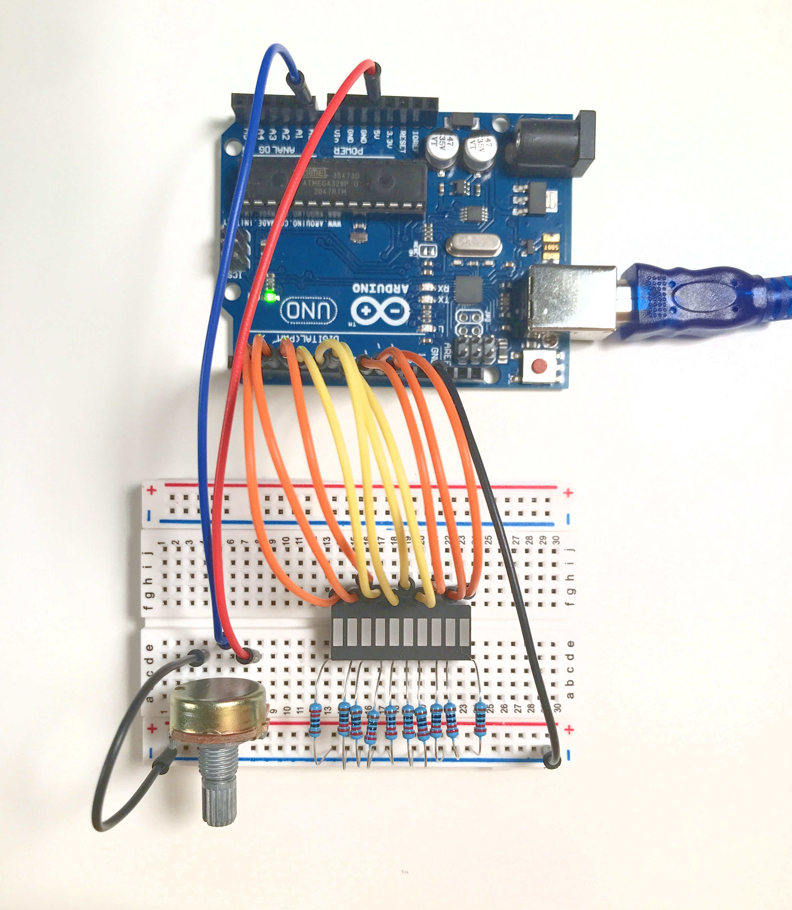

### Potentiometer controlled bar graph 

Reads potentiometer input on pin 0 (A0) and scales analog input into 

discrete units that map to digital outputs to display LEDs on a 10 segment bar graph 

  

