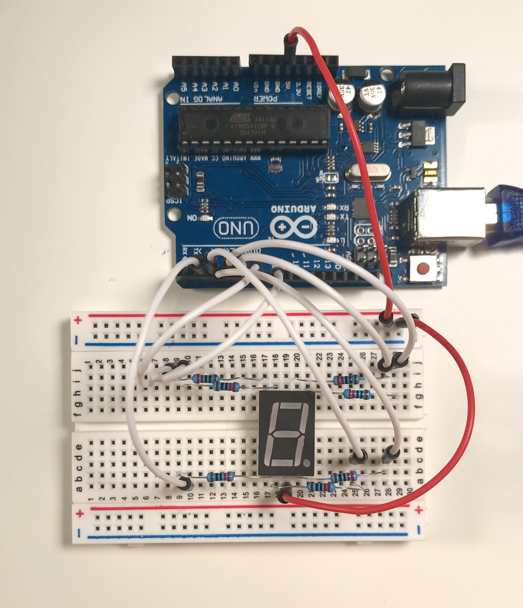

 7 segment display 

  Runs a test on 7 segment digital display
  
  1) turn on each segment in display pin number sequence
  2) all on
  3) countdown 3,2,1,0
  4) run through segments sequentially & repeatedly
  
  Note: pins set for common anode type (not common cathode)

  There is also a short video of the project in operation in this directory
  
  The 7 segment display interfaced to Arduino with a shift register project has 
  more comprehensive tesing and display sequences
  

  

